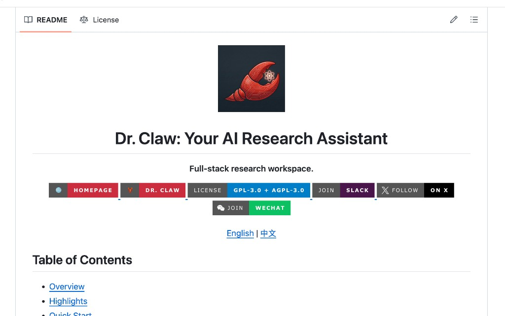
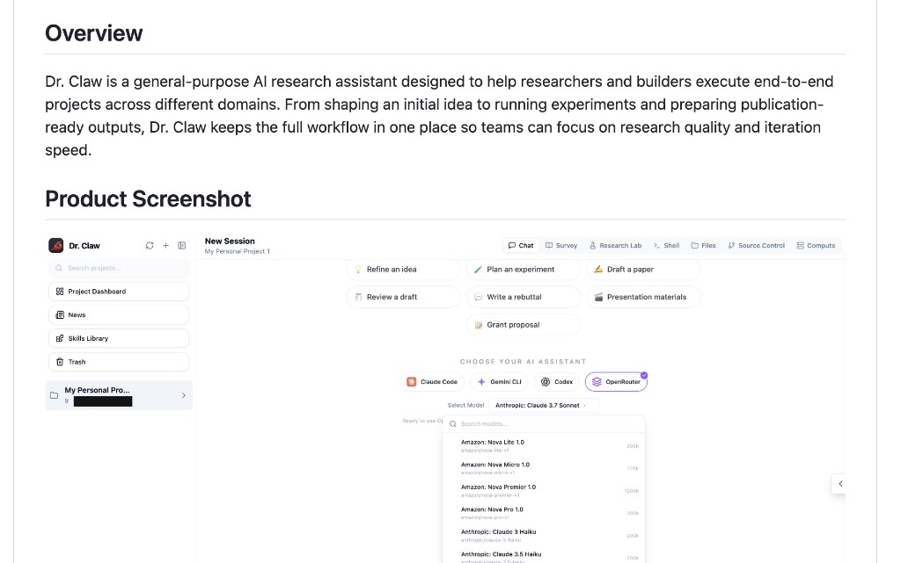

<p align="center">
  <h1 align="center">Nano-Claw-Code</h1>
  <p align="center">
    <em>A distilled and optimized coding agent in ~5,800 lines of Python — less code, same performance.</em>
  </p>
  <p align="center">
    English | <a href="README_zh.md">中文</a>
  </p>
</p>

---

## What Is This?

Nano-Claw-Code is a **lightweight Python coding agent** distilled from the full [Claude Code](https://github.com/anthropics/claude-code) framework. The distillation follows a two-stage pipeline:

1. **TypeScript pruning** — We analyzed tool usage on SWE-bench and removed 29 unused tools and 4 service groups from the original Claude Code (~405,500 → ~378,100 core lines).
2. **Python re-implementation** — We then rewrote the core agent loop, tools, and CLI in pure Python, compressing ~378,100 lines of TypeScript into **~5,800 lines of Python** while preserving the same tool-use interface and agentic capabilities.

We provide code for result evaluation on [SWE-bench Lite](https://www.swebench.com/).

Nano-Claw-Code is part of **[Dr. Claw](https://github.com/OpenLAIR/Dr.Claw)**, a full-stack AI research workspace.

<p align="center">
  
</p>

<p align="center">
  
</p>

---

## Roadmap

- [x] Distill Claude Code (42 → 13 tools, TypeScript pruning)
- [x] Python re-implementation — nano-claw-code (~5,800 lines, 12 tools)
- [x] SWE-bench evaluation harness with full trace logging (included in repo)
- [x] Comparative evaluation on SWE-bench Lite (40/300 instances)
- [ ] Full SWE-bench Lite run (300 instances)
- [ ] SWE-bench Verified run (500 instances)
- [ ] Third-party model evaluation via OpenRouter (Kimi, MiniMax)
- [ ] Distillation dataset from agent traces

---

## Key Results

Evaluated on the first 40 instances of SWE-bench Lite using `claude-sonnet-4-20250514`:

| Variant | Language | Tools | Core Lines | Submitted | Resolved | Resolve Rate |
|---------|----------|-------|------------|-----------|----------|--------------|
| **Claude Code** (full) | TypeScript | 42 | ~405,500 | 38 | 22 | 57.9% |
| **Nano-Claw-Code** (this repo) | Python | 12 | **~5,800** | 38 | 22 | 57.9% |

> ~70x less code, identical resolve rate. Full benchmark runs (300 instances) are in progress.

---

## Contributions

### 1. Tool-Usage-Guided Distillation

The full Claude Code agent defines **~56 tools** spanning shell execution, file I/O, web access, multi-agent orchestration, plan modes, cron scheduling, MCP integrations, and more. We analyzed which tools the agent actually invokes during SWE-bench tasks and removed everything non-essential:

<details>
<summary><b>29 tools removed</b> (click to expand full list)</summary>

| Removed Tool | Lines | Why Removed |
|-------------|-------|-------------|
| `PowerShellTool` | 8,959 | Windows-only; `BashTool` covers Unix |
| `LSPTool` | 2,005 | Experimental language server integration |
| `SendMessageTool` | 997 | Inter-agent messaging (team/swarm) |
| `EnterPlanModeTool` / `ExitPlanModeTool` | 934 | Plan mode UI (not used in SWE-bench) |
| `ConfigTool` | 809 | Anthropic-internal settings |
| `BriefTool` | 610 | Output formatting mode |
| `ToolSearchTool` | 593 | Dynamic tool discovery |
| `EnterWorktreeTool` / `ExitWorktreeTool` | 563 | Git worktree isolation |
| `ScheduleCronTool` / `CronDelete` / `CronList` | 543 | Cron job scheduling |
| `TeamCreateTool` / `TeamDeleteTool` | 534 | Multi-agent swarm orchestration |
| `TaskCreate` / `TaskGet` / `TaskUpdate` / `TaskList` / `TaskStop` / `TaskOutput` | 1,761 | V2 task management system |
| `ListMcpResourcesTool` / `ReadMcpResourceTool` | 381 | MCP resource access |
| `AskUserQuestionTool` | 309 | Structured question UI |
| `McpAuthTool` | 215 | MCP authentication |
| `RemoteTriggerTool` | 192 | Remote agent triggers |
| `SyntheticOutputTool` | 163 | Structured JSON output |
| `REPLTool` | 85 | REPL mode wrapper |
| `SleepTool` | 17 | Sleep utility |
| `TungstenTool` | 5 | Anthropic-internal |
| `WorkflowTool` | 2 | Workflow placeholders |

</details>

- **4 service groups removed** (~7,400 lines) — team memory sync, voice STT, LSP server management, and plugin lifecycle
- **~27,400 lines cut** (6.8% of core framework) with **no performance degradation**

### 2. Python Re-implementation

We rewrote the pruned agent in pure Python — **~5,800 lines** across 15 modules with **12 tools**:

| Tool | What It Does | Original Claude Code Equivalent |
|------|-------------|--------------------------------|
| `Read` | File reading with image/directory support | `FileReadTool` |
| `Write` | File creation/overwrite | `FileWriteTool` |
| `Edit` | String-replace editing with diff preview | `FileEditTool` |
| `Bash` | Persistent-cwd shell with sandbox patterns | `BashTool` |
| `Glob` | Pattern matching with `**/` auto-prepend | `GlobTool` |
| `Grep` | Regex search via ripgrep or Python fallback | `GrepTool` |
| `WebFetch` | URL fetch with HTML→text conversion | `WebFetchTool` |
| `WebSearch` | DuckDuckGo HTML search | `WebSearchTool` |
| `NotebookEdit` | Jupyter cell create/edit | `NotebookEditTool` |
| `TodoWrite` | In-memory task tracking with merge | `TodoWriteTool` |
| `Agent` | Sub-agent spawning with tool filtering | `AgentTool` |
| `Skill` | Skill loading from `.claude/skills/` | `SkillTool` |

Beyond tools, the agent preserves key infrastructure:

| Capability | Module | What It Does |
|-----------|--------|-------------|
| Sub-agent system | `agents.py` | 3 built-in profiles (general, explore, plan) + custom agents from `.claude/agents/*.md` |
| Skill system | `skills.py` | Discovers skills from `~/.claude/skills/` with frontmatter metadata (inline/forked execution) |
| Memory hierarchy | `memory.py` | Loads layered `CLAUDE.md` context from global → per-directory with `@include` support |
| Context compaction | `agent.py` | Monitors token budget (~200K), summarizes old messages when 75% threshold exceeded |
| Prompt caching | `agent.py` | Anthropic `cache_control: ephemeral` breakpoints to reduce token costs |
| Permission system | `permissions.py` | 3 modes (accept-all / manual / auto) with safe-command classification |
| Session persistence | `session.py` | Save/load/resume conversations with auto-save and search |
| API retry | `agent.py` | Exponential backoff with jitter on 429/5xx, respects `Retry-After` headers |
| OpenAI compat | `openai_compat.py` | Alternative backend for non-Anthropic providers (Kimi, MiniMax, etc.) |

### 3. Comparative SWE-bench Evaluation

Both variants are evaluated under identical conditions with full trace logging — every tool call, model response, and thinking block is captured for analysis.

---

## Distillation Pipeline

```
┌─────────────────────┐      prune 29 tools     ┌─────────────────────┐        rewrite in       ┌─────────────────────┐
│  Claude Code        │ ──────────────────────▶ │  (intermediate)     │ ──────────────────────▶ │  Nano-Claw-Code     │
│  TypeScript         │     4 service groups    │  TypeScript         │          Python         │  Python             │
│  ~405,500 lines     │      -27,400 lines      │  ~378,100 lines     │                         │  ~5,800 lines       │
│  42 tools           │                         │  13 tools           │                         │  12 tools           │
└─────────────────────┘                         └─────────────────────┘                         └─────────────────────┘
```

---

## Repository Structure

```
nano-claw-code/
├── nano_claw_code/            # Agent source code
│   ├── cli.py                 #   Interactive REPL, CLI, startup banner (1,639 lines)
│   ├── tools_impl.py          #   12 core tool implementations (1,066 lines)
│   ├── agent.py               #   Agent loop, compaction, prompt caching, retry (659 lines)
│   ├── openai_compat.py       #   OpenAI-compatible API adapter (599 lines)
│   ├── agents.py              #   Sub-agent profiles & custom agent loading (302 lines)
│   ├── skills.py              #   Skill discovery & execution (294 lines)
│   ├── config.py              #   Configuration management (279 lines)
│   ├── session.py             #   Session persistence (233 lines)
│   ├── prompts.py             #   System prompts (189 lines)
│   ├── stream_json.py         #   Stream-JSON output protocol (185 lines)
│   ├── frontmatter.py         #   CLAUDE.md frontmatter parsing (137 lines)
│   ├── permissions.py         #   Permission handling (133 lines)
│   └── memory.py              #   Memory management (111 lines)
├── swebench_harness/          # SWE-bench evaluation harness
│   ├── run_swebench_claude_code.py  # Main evaluation script (inference + evaluation)
│   ├── run.sh                 #   One-command launcher (install, predict, evaluate)
│   ├── compare_results.py     #   Cross-variant result comparison
│   ├── requirements.txt       #   Harness dependencies (datasets, swebench)
│   ├── instance_ids_pilot_8.txt   # 8-instance pilot subset
│   ├── instance_ids_full_50.txt   # 50-instance subset
│   └── results/               #   Predictions & evaluation reports
├── start.sh                   # Launch script
├── pyproject.toml             # Python package config
└── assets/                    # Screenshots & images
```

---

## Setup

### Prerequisites

| Requirement | Version | Purpose |
|-------------|---------|---------|
| **Python** | >= 3.10 | Agent runtime |
| **Docker** | latest | SWE-bench test execution (optional) |

### Step 1 — Install

```bash
pip install -e .
```

### Step 2 — Configure API access

```bash
# Option A: Direct Anthropic API
export ANTHROPIC_API_KEY="sk-ant-xxx"

# Option B: OpenRouter (for Kimi, MiniMax, etc.)
export OPENROUTER_API_KEY="sk-or-xxx"
export OPENROUTER_MODEL="moonshotai/kimi-k2"

# Option C: LiteLLM Proxy
export ANTHROPIC_BASE_URL="http://127.0.0.1:4000"
export ANTHROPIC_API_KEY="sk-anything"
export MODEL="moonshotai/kimi-k2"
```

### Step 3 — Run

```bash
./start.sh
```

---

## Usage

### Interactive Mode

```bash
./start.sh
```

### One-shot Prompt

```bash
./start.sh -p "Explain this codebase"
```

### Using Third-Party Models via OpenRouter

```bash
export OPENROUTER_API_KEY="sk-or-xxx"
export OPENROUTER_MODEL="moonshotai/kimi-k2"
./start.sh
```

For unified provider management, you can also use [LiteLLM Proxy](https://docs.litellm.ai/):

```bash
export ANTHROPIC_BASE_URL="http://127.0.0.1:4000"
export ANTHROPIC_API_KEY="sk-anything"
export MODEL="moonshotai/kimi-k2"
```

---

## SWE-bench Evaluation

The repository includes a self-contained evaluation harness in `swebench_harness/` that handles both **inference** (generating patches) and **evaluation** (running SWE-bench grading).

### Prerequisites

```bash
pip install -e .                          # Install nano-claw-code
pip install -r swebench_harness/requirements.txt  # Install harness deps (datasets, swebench)
```

Docker must be running — SWE-bench uses Docker containers to execute and grade patches.

### Quick Start (One Command)

```bash
cd swebench_harness
./run.sh --max-instances 10
```

This will:
1. Auto-install `nano-claw-code` if not already installed
2. Generate predictions on SWE-bench Lite instances
3. Run the SWE-bench evaluation harness and produce a JSON report

### Step-by-Step

**Step 1 — Generate predictions:**

```bash
cd swebench_harness

# Run on first N instances
python run_swebench_claude_code.py --max-instances 10

# Run on a specific subset
python run_swebench_claude_code.py --instance-ids instance_ids_pilot_8.txt

# Resume from a specific instance
python run_swebench_claude_code.py --resume-from django__django-11099
```

Predictions are saved to `results/nano-claw-code/predictions.jsonl` along with full traces (tool calls, model responses, thinking) in `results/nano-claw-code/traces/`.

**Step 2 — Evaluate predictions:**

```bash
python run_swebench_claude_code.py --evaluate
```

This runs the official SWE-bench Docker evaluation and produces a JSON report (e.g., `claude-sonnet-4-20250514.nano-claw-code-swebench.json`).

**Step 3 — View results:**

```bash
# Summary is printed to stdout; detailed report in the JSON file
cat claude-sonnet-4-20250514.nano-claw-code-swebench.json | python -m json.tool
```

### Configuration

| Flag | Description | Default |
|------|-------------|---------|
| `--max-instances N` | Limit number of instances to evaluate | all |
| `--instance-ids FILE` | Path to a file listing specific instance IDs | — |
| `--model MODEL` | Model to use | `claude-sonnet-4-20250514` |
| `--dataset DATASET` | SWE-bench dataset | `princeton-nlp/SWE-bench_Lite` |
| `--split SPLIT` | Dataset split | `test` |
| `--max-turns N` | Max agentic turns per instance | 30 |
| `--resume-from ID` | Resume from a specific instance | — |
| `--evaluate` | Run evaluation only (skip inference) | — |
| `--predictions FILE` | Custom predictions file for evaluation | auto-detected |
| `--bare` | Skip hooks/LSP for faster inference | — |
| `-v, --verbose` | Enable debug logging | — |

### Using with OpenRouter / LiteLLM

```bash
export OPENROUTER_API_KEY="sk-or-xxx"
export OPENROUTER_MODEL="moonshotai/kimi-k2"
cd swebench_harness && ./run.sh --max-instances 5
```

---

## License

This project builds upon [Claude Code](https://github.com/anthropics/claude-code) by Anthropic.
